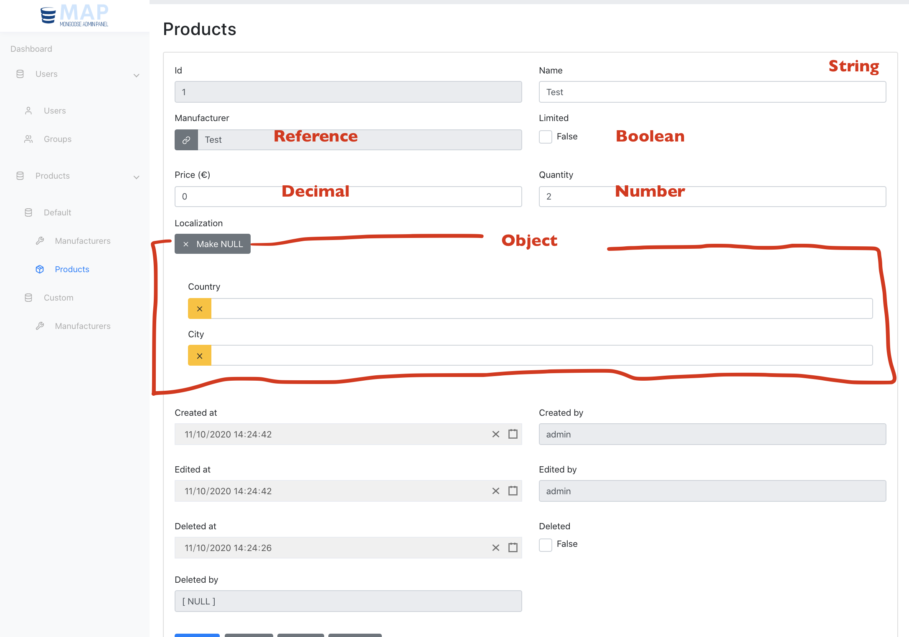

# Mongoose Admin Panel

Package for generating an admin panel for Mongoose.
It comes out of the box with a React front-end and an Express back-end. Fully customizable.

It supports **relationships** and ensure theirs integrity.

# Screenshots

Few examples from [Mongoose Admin Panel - Example](https://github.com/quantumglitch/mongoose-admin-panel-example)

# Short Setup

If you are searching for a simple solution to generate an admin panel, just download the example project, load your mongoose models and the job's done. Follow the instructions on [Mongoose Admin Panel - Example](https://github.com/quantumglitch/mongoose-admin-panel-example).

# How it works

In this project you will find two packages: backend and frontend. One gives support for making the backend of the control panel while the second gives support for making the frontend of the control panel. **At the moment** the backend has an adapter only for using it with **express** while the frontend includes only a set of **React** compatible components.

# Concepts

**MAP** = Mongoose Admin Panel

## Core

The core of the project is based on the backend class **Component** (aka FormComponent). In order to make the user interact with the database, **MAP** provides a **Form** class, a derived class of **Component**: this is managed on the frontend through its specific React component (ComponentRenderer) and on the backend through its specific representation class. Every time an action occurs on the frontend (or a state transformation that needs a computation by the backend) the Form's model is parsed to JSON and sent to the backend. The backend processes the model, executing his life cycle, and then serialize it and send it back to the frontend.

### Component

A **Component** is the base class of **MAP**.
It has its own **life cycle** and its own children components.
So every Component could be a tree of components.

#### Life cycle

The life cycle includes 4 stages:

1. Parse ( Convert the JSON which represents the Component to the needed internals )
2. Load ( Load the needed data for the basic working of the component )
3. Execute ( Based on the parsed state, execute the needed action to bring the component to its next state )
4. Serialize ( Convert to JSON the component )

# Backend

[Detailed guide here](https://github.com/QuantumGlitch/mongoose-admin-panel/blob/master/backend/README.md)

# Frontend

[Detailed guide here](https://github.com/QuantumGlitch/mongoose-admin-panel/blob/master/frontend/README.md)
